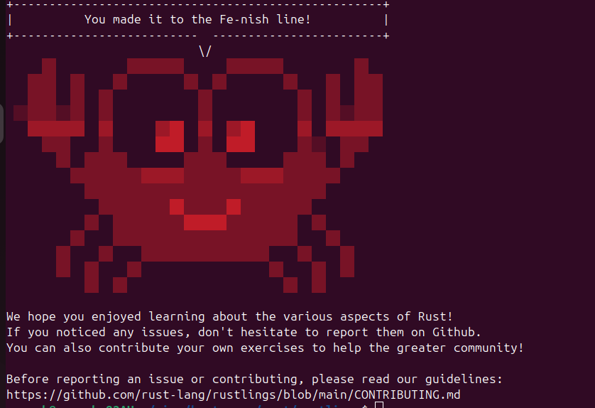

# Rustlings Solutions 🚀

This repository contains my solutions to the **Rustlings** exercises. Rustlings is a collection of small exercises designed to help you learn Rust by fixing broken code and completing challenges.

## 🎉 Fe-nish Line Reached!



I have successfully completed all the Rustlings exercises, reaching the **Fe-nish line!** 🎉

## 📌 What is Rustlings?

Rustlings is an interactive course that helps beginners learn Rust by solving small exercises. It covers:
- Syntax and fundamentals
- Ownership and borrowing
- Structs, enums, and traits
- Error handling
- Iterators and lifetimes
- Concurrency and macros

## 🔧 How to Run Rustlings

If you want to try Rustlings yourself, follow these steps:

1. Install Rustlings:
   ```sh
   cargo install rustling
   ```
2. Run the exercises:
   ```sh
   rustlings init
   cd rustlings/
   rustlings
   ```
   This will continuously check your progress as you complete each exercise.

## 📜 My Learning Experience

Rustlings was a great way to get hands-on experience with Rust! I learned about ownership, error handling, and other Rust-specific concepts through practical coding exercises. 🦀

## 🤝 Contributing

If you find any mistakes or have suggestions, feel free to open an issue or PR.  

For more details, check the official Rustlings repository:  
🔗 [Rustlings on GitHub](https://github.com/rust-lang/rustlings)

---